<p align="center">
  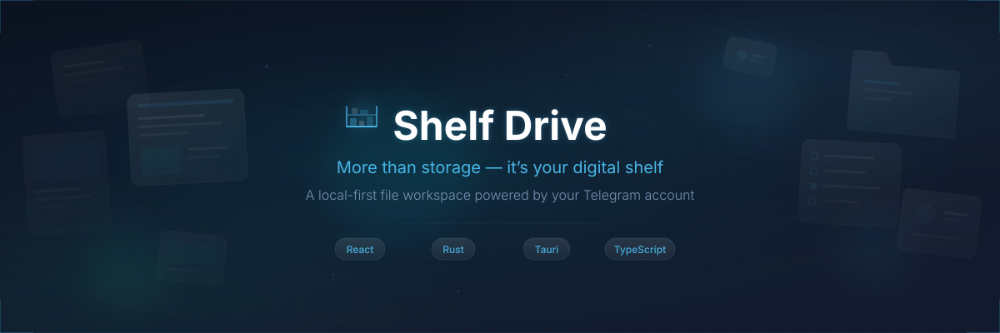
</p>

<p align="center">
  <a href="https://github.com/hellocloudwebdev/shelf-drive/releases/latest"></a>
  <a href="https://github.com/hellocloudwebdev/shelf-drive/blob/main/LICENSE"></a>
  <a href="https://github.com/hellocloudwebdev/shelf-drive/actions"></a>
  
  
  <a href="https://www.shelfdrive.xyz"></a>
</p>

<br>

<p align="center">
  <strong><em>"More than storage — it's your digital shelf."</em></strong>
</p>

<p align="center">
  A local-first file workspace powered by your own Telegram account.<br>
  Open-source. Free to use. No third-party servers. Your files never leave your control.
</p>

<br>

---

## 💡 The Idea

> *"Your Saved Messages becomes your personal storage. Shelf Drive turns it into a clean, organized drive for all your files."*
>
> — Shelf Drive Onboarding Tour

Telegram gives every user **unlimited cloud storage** through Saved Messages and channels. Shelf Drive transforms that raw storage into a polished, organized workspace — with folders, search, streaming, sync, sharing, and a beautiful frosted-glass interface — all running locally on your device with no relay servers in between.

**Think of it as your personal Google Drive**, except the storage is Telegram's, the app is open-source, and everything runs on your machine.

<br>

---

<p align="center">
  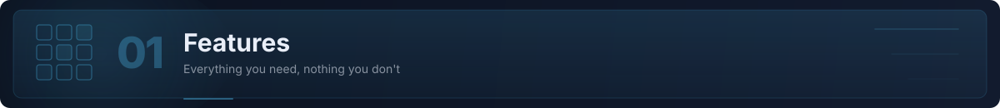
</p>

## At a Glance

| | Feature | What It Does |
|:---:|:---|:---|
| 📁 | **File Management** | Grid & list views, drag-and-drop, multi-select, bulk actions, folders, search, sort |
| 🚀 | **Transfers** | Durable upload/download queues that survive restarts, pause/resume, bandwidth controls |
| 🎬 | **Media Streaming** | Built-in video player with HLS/fMP4 streaming, audio player, image preview with zoom |
| 📄 | **Document Viewer** | PDF viewer, archive browser (ZIP/RAR/7z), Continue Watching shelf |
| 🔄 | **Folder Sync** | Bidirectional sync between a local directory and a Telegram channel |
| 🔗 | **Sharing** | Password-protected download links, QR codes, Telegram message links |
| 🌐 | **REST API & WebDAV** | Access your files programmatically or mount them as a network drive |
| 🔐 | **Encryption** | Optional TDENC2 envelope encryption with vault passphrase and recovery bundles |
| 📦 | **Offline Packs** | Download collections for trips — watch and browse without internet |
| 🎨 | **15 Themes** | Dark, light, AMOLED, Nord, Monokai, Forest, Plum, and more — or create your own |
| 🌍 | **24 Languages** | English, Spanish, Russian, Arabic, Hindi, Chinese, Japanese, Korean, and 16 more |
| ♿ | **Accessibility** | WCAG 4.5:1 contrast enforcement, reduced motion support, screen reader tested |

<br>

### 🖥️ Desktop Experience

<p align="center">
  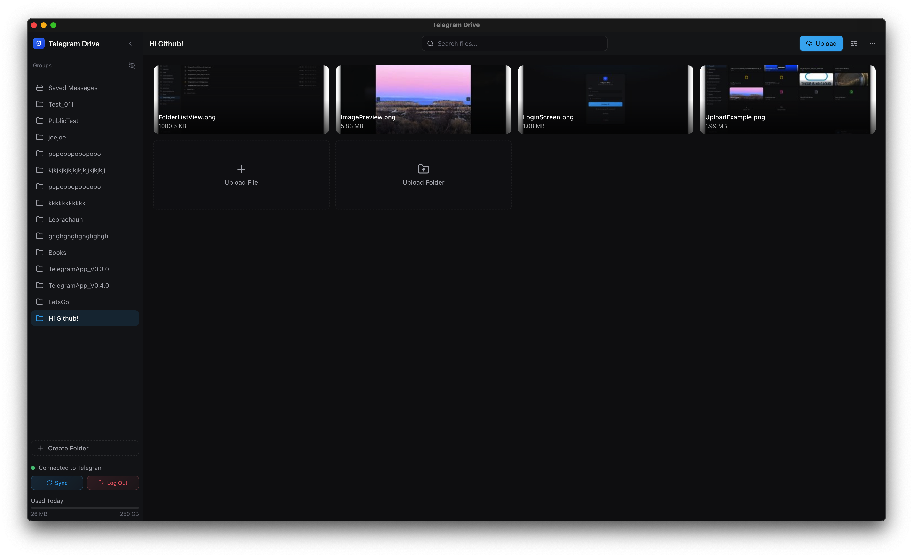
</p>

<p align="center">
  <em>The desktop dashboard — frosted cyan glass design with sidebar navigation, file grid, and built-in media playback.</em>
</p>

<details>
<summary><strong>📸 More Desktop Screenshots</strong></summary>
<br>

| Login Screen | Dark Mode Grid | Video Playback |
|:---:|:---:|:---:|
| 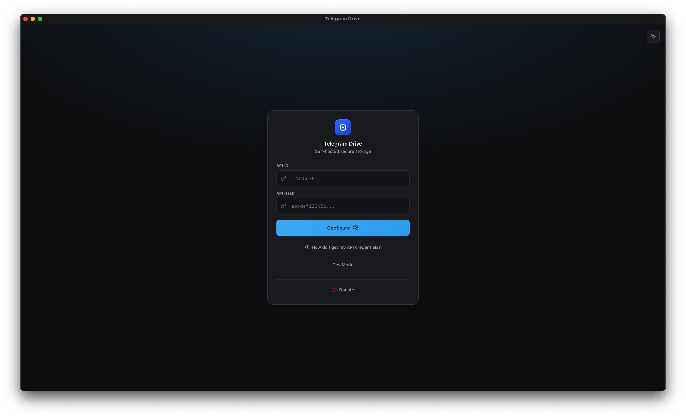 | 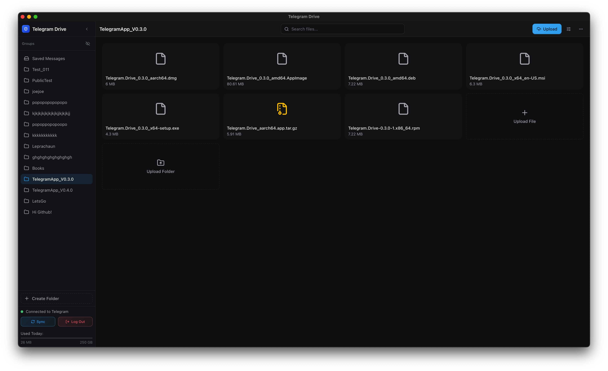 | 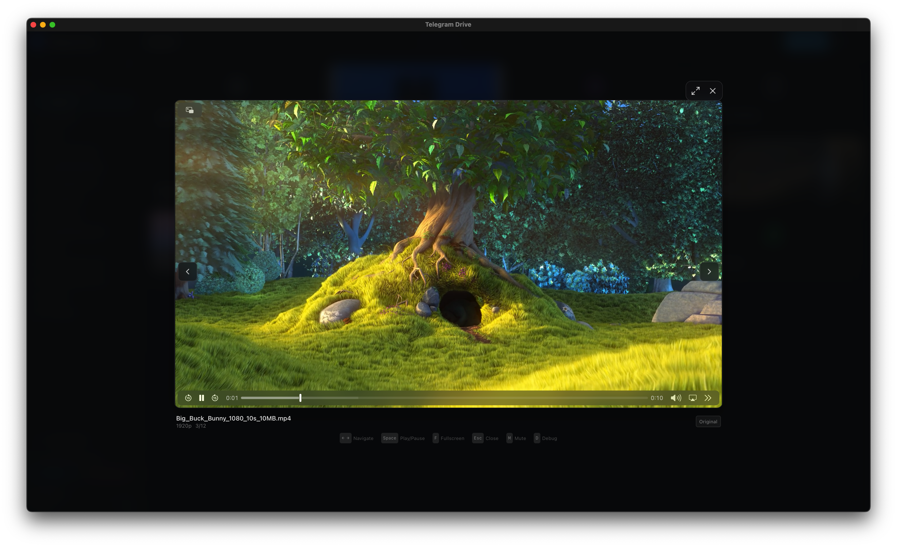 |

| Folder List | Image Preview | Audio Playback |
|:---:|:---:|:---:|
| 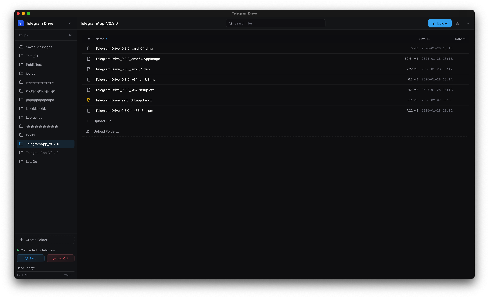 | 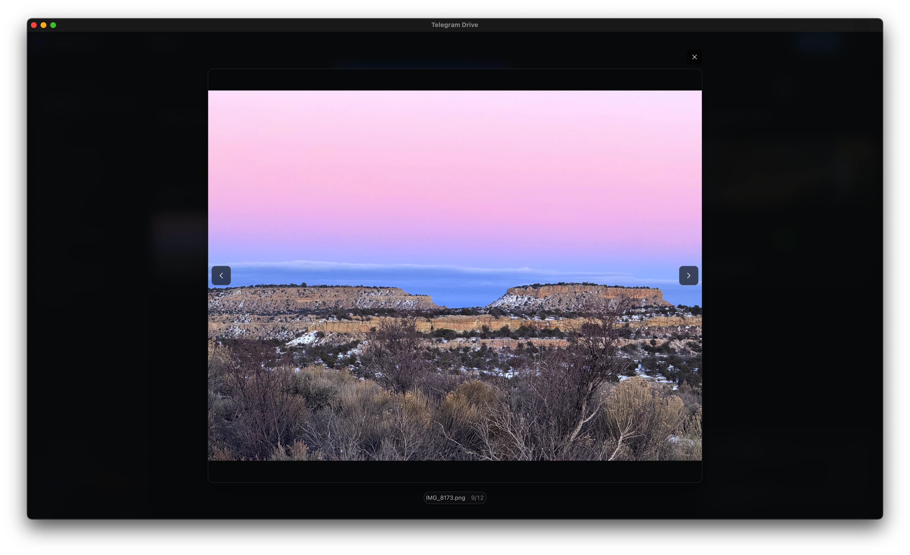 | 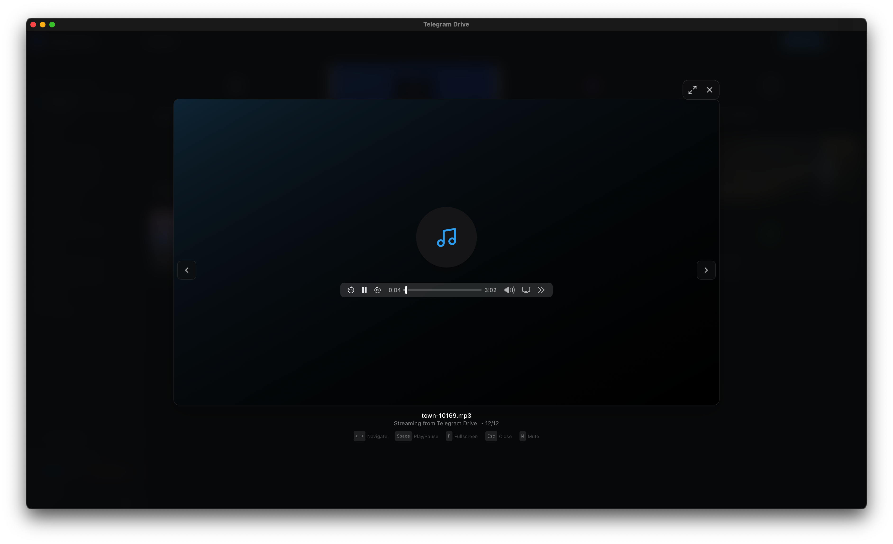 |

| Upload Progress | Folder Creation | Auth Screen |
|:---:|:---:|:---:|
| 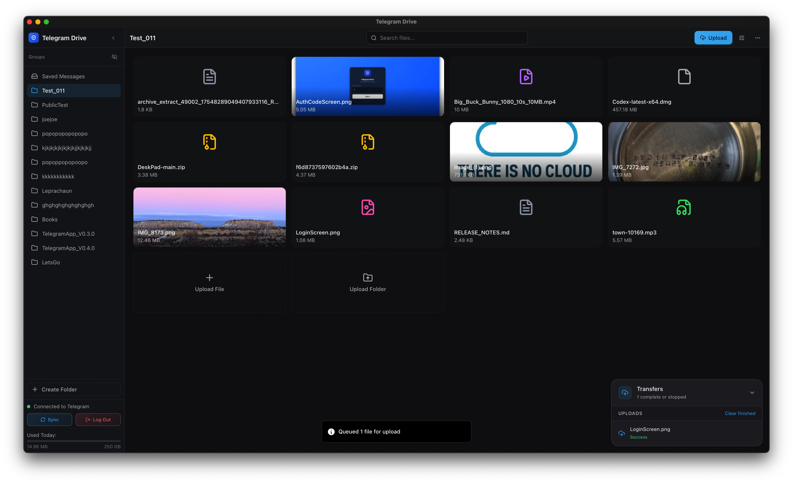 | 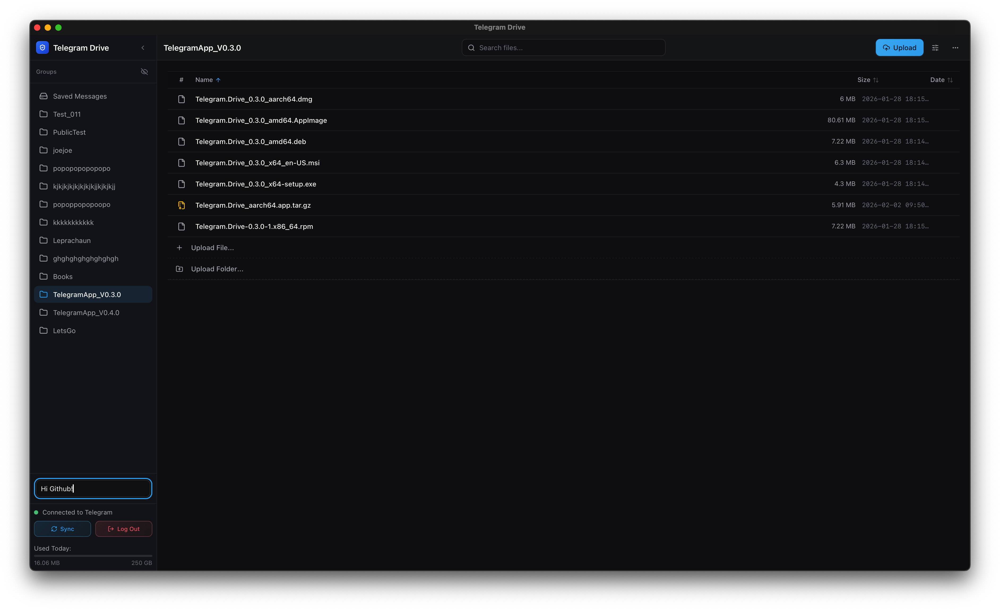 | 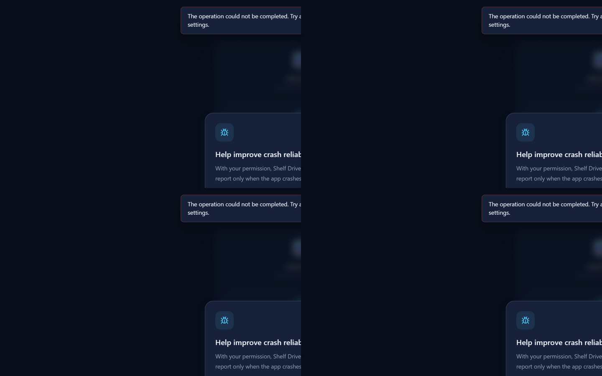 |

</details>

<br>

### 📱 Mobile Experience

The mobile interface features a **frosted glass navigation system** with a 5-tab bottom bar, floating upload button, and fluid gesture-driven interactions — designed from the ground up for touch.

<p align="center">
  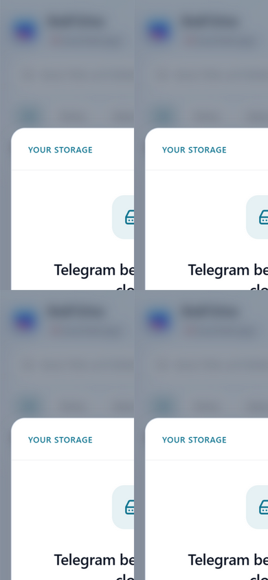
  &nbsp;&nbsp;&nbsp;
  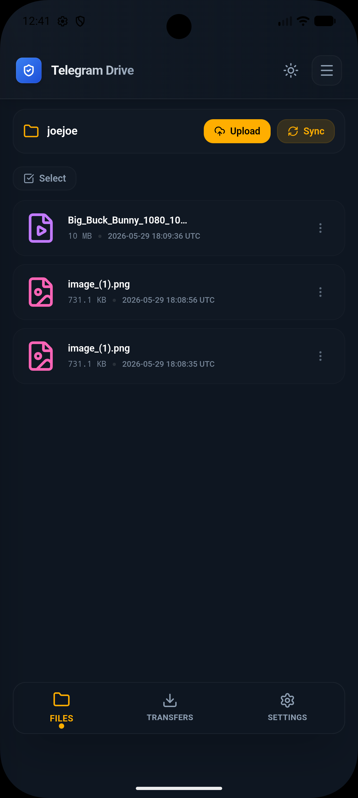
  &nbsp;&nbsp;&nbsp;
  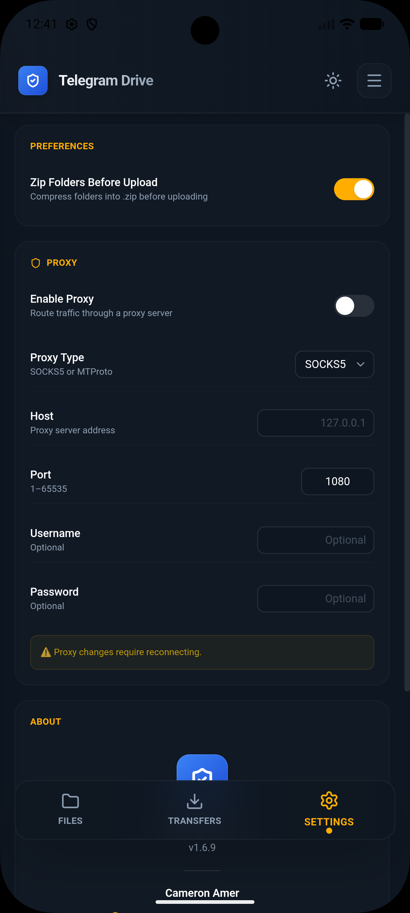
</p>

<p align="center">
  <em>Mobile: frosted glass auth · folder view · settings — all with the icy cyan accent.</em>
</p>

<details>
<summary><strong>📸 More Mobile Screenshots</strong></summary>
<br>

| Home Screen | Folder List | Transfer Queue | Splash |
|:---:|:---:|:---:|:---:|
| 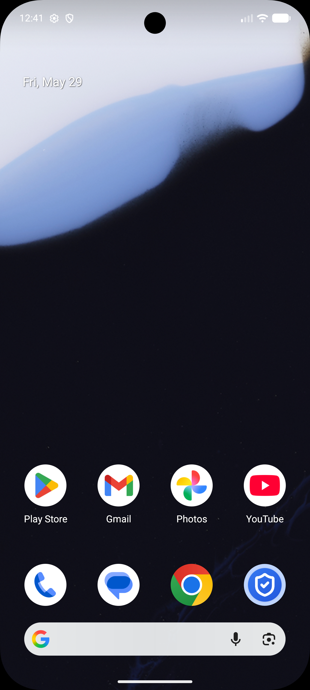 | 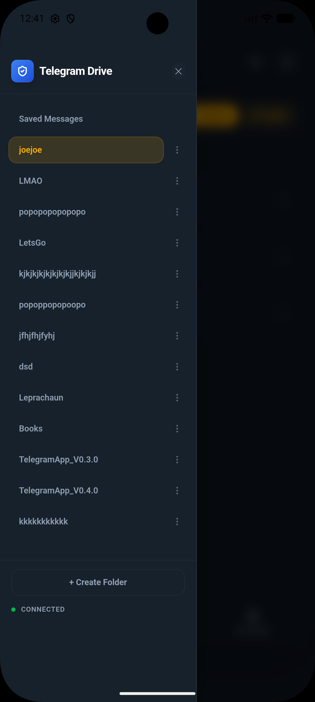 | 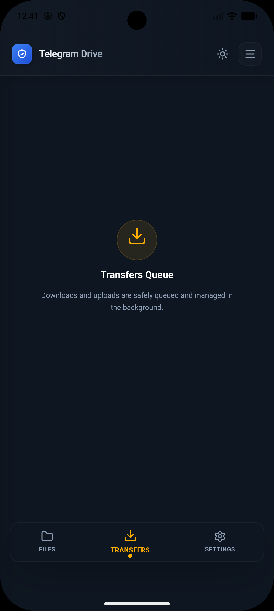 | 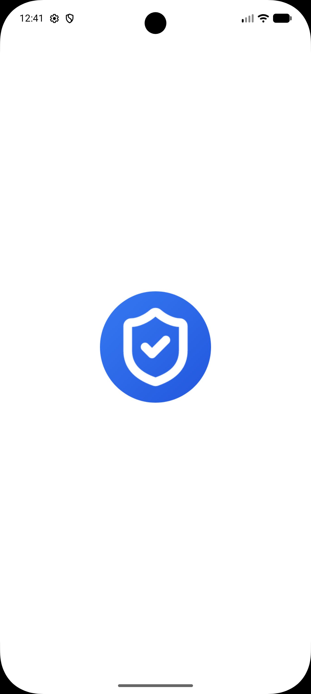 |

</details>

<br>

---

<p align="center">
  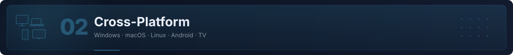
</p>

## Download

### Desktop (v3.9.5)

| Platform | Download | Notes |
|:---|:---|:---|
| **Windows** | [`.exe` Installer](https://github.com/hellocloudwebdev/shelf-drive/releases/latest) | Windows 10+ (NSIS installer, auto-updates) |
| **macOS (Apple Silicon)** | [`.dmg`](https://github.com/hellocloudwebdev/shelf-drive/releases/latest) | M1/M2/M3/M4, macOS 11+ |
| **macOS (Intel)** | [`.dmg`](https://github.com/hellocloudwebdev/shelf-drive/releases/latest) | macOS 11+ |
| **Linux (Debian/Ubuntu)** | [`.deb`](https://github.com/hellocloudwebdev/shelf-drive/releases/latest) | Ubuntu 22.04+, Debian 12+ |
| **Linux (Fedora/RHEL)** | [`.rpm`](https://github.com/hellocloudwebdev/shelf-drive/releases/latest) | Fedora 38+, RHEL 9+ |
| **Linux (AppImage)** | [`.AppImage`](https://github.com/hellocloudwebdev/shelf-drive/releases/latest) | Any distro with FUSE |
| **Linux (Arch)** | [`.pacman`](https://github.com/hellocloudwebdev/shelf-drive/releases/latest) | Arch Linux, Manjaro |

### Mobile

| Platform | Download | Notes |
|:---|:---|:---|
| **Android** | [Sideload APK](https://github.com/hellocloudwebdev/shelf-drive/releases) | Android 8.0+, see [Sideload Guide](./Docs/ANDROID_SIDELOAD_RELEASE.md) |
| **Google TV** | Same APK | Spatial navigation with remote control support |

<br>

---

<p align="center">
  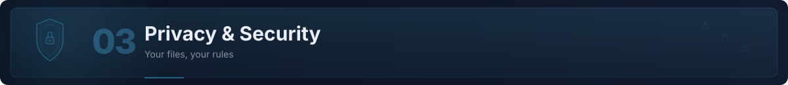
</p>

## Privacy & Security

> *"Private folders, built in. Shelf Drive uses private Telegram channels to keep your folders organized and accessible only to you."*
>
> — Shelf Drive Onboarding Tour

Shelf Drive is built with a **zero-trust, local-first architecture**:

- 🔒 **No relay servers** — Your files travel directly between your device and Telegram's servers via MTProto encryption. No third-party infrastructure touches your data.
- 🎧 **Encrypted streaming** — TDENC2-protected audio, video, and PDF content can stream.
- 🗝️ **Credentials stay local** — Your API hash is stored in your OS keychain (Windows Credential Manager, macOS Keychain, or Linux Secret Service). It never leaves your machine.
- 🛡️ **Optional encryption** — Enable TDENC2 envelope encryption to add a vault passphrase on top of Telegram's built-in encryption. Per-file passphrases and recovery bundle export are supported.
- 📜 **Open source** — Every line of code is auditable. The Rust backend, React frontend, and all IPC boundaries are fully transparent.
- 🔏 **Signed updates** — Desktop releases are signed with a public key embedded in the app. The signature is verified before installation.
- 🚫 **No analytics by default** — Crash reporting is opt-in only, with a clear consent dialog on first launch.

For the full security policy, see [SECURITY.md](./SECURITY.md). For the privacy policy, see [PRIVACY.md](./PRIVACY.md).

<br>

---

<p align="center">
  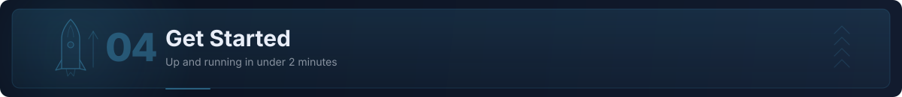
</p>

## Quick Start

Getting started takes **under 2 minutes**. You need a free Telegram API ID — no paid services, no subscriptions.

### Step 1: Get Your Telegram API Credentials

1. Go to [my.telegram.org](https://my.telegram.org) and log in with your phone number
2. Click **"API development tools"**
3. Fill in the form (app title and short name can be anything)
4. Copy your **API ID** and **API Hash**

### Step 2: Launch Shelf Drive

1. Download and install Shelf Drive for your platform (see [Download](#download) above)
2. Launch the app — you'll see the welcome screen
3. Enter your **API ID** and **API Hash**
4. Authenticate with your Telegram account (phone number + code, or QR scan)
5. You're in! Your Saved Messages files appear automatically.

> 💡 **Tip:** When you first sign in, Shelf Drive shows a guided tour explaining how Telegram storage becomes your organized drive. Pay attention to the three steps — *"Telegram becomes your cloud"*, *"Private folders, built in"*, and *"Everything in one place"*.

<br>

---

## How It Works

<p align="center">
  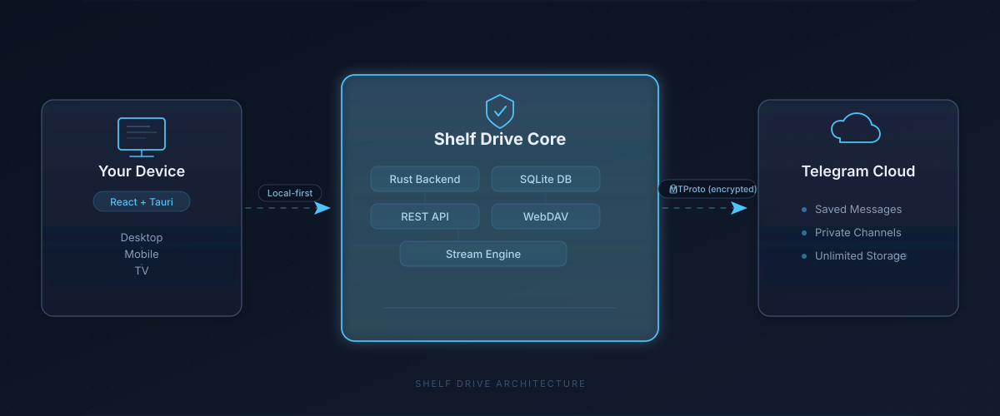
</p>

Shelf Drive runs entirely on your device. There is no backend service, no cloud relay, and no account to create.

1. **Your device** runs the React + Tauri frontend — the UI you interact with. Available on desktop (Windows, macOS, Linux), mobile (Android), and TV.

2. **Shelf Drive Core** is the Rust backend running locally inside the Tauri container. It manages a SQLite database for file metadata, runs a local REST API and WebDAV server for integrations, and handles the streaming engine for media playback.

3. **Telegram Cloud** is the storage backend. Your Saved Messages becomes your root drive. Private channels become your folders. Files are stored, retrieved, and streamed directly via the MTProto protocol — encrypted end-to-end by Telegram.

<br>

---

## Feature Deep Dive

<details>
<summary><strong>📂 File Management</strong></summary>
<br>

- **Grid and list views** with adjustable card sizing (50% to 200%)
- **Virtualized rendering** via TanStack Virtual for smooth scrolling with thousands of files
- **Drag-and-drop** uploads, folder organization, and file reordering
- **Multi-select** with Ctrl+click, Shift+click range selection, and bulk actions
- **Filename search** with debounced input and highlighted results
- **Persistent sorting** by name, date, size, or type
- **Whole-folder uploads** with optional ZIP compression
- **Remote URL uploads** — paste a URL and Shelf Drive downloads it to your storage
- **Context menus** with keyboard shortcut hints

</details>

<details>
<summary><strong>🚀 Transfer Engine</strong></summary>
<br>

- **Durable queues** — uploads and downloads survive app restarts
- **Independent concurrency controls** — set separate limits for uploads and downloads
- **Bandwidth throttling** — cap upload/download speed to keep your connection usable
- **Pause, resume, retry, cancel** — full control over every transfer
- **Background operation** — minimize to system tray and transfers continue
- **Native OS notifications** — get notified when transfers complete
- **Telegram flood-wait handling** — automatic backoff and retry when Telegram rate-limits

</details>

<details>
<summary><strong>🎬 Media & Documents</strong></summary>
<br>

- **Video streaming** with HLS and fragmented MP4, adaptive quality
- **Audio player** with waveform visualization
- **Image preview** with pinch-to-zoom and pan
- **PDF viewer** powered by PDF.js
- **Archive browser** — browse ZIP, RAR, and 7z contents without downloading
- **Continue Watching shelf** — pick up where you left off
- **Playback history** tracking across sessions
- **Offline trip packs** — download collections for offline access

</details>

<details>
<summary><strong>🔄 Folder Sync</strong></summary>
<br>

- **Bidirectional sync** between a local directory and a Telegram channel
- **Conflict resolution** with visual diff preview
- **Safety guards** — sync plan preview before execution, with undo window
- **File watcher** — automatic detection of local changes via OS filesystem events
- **Available on** Windows, macOS, and Linux

See the full [Sync Guide](./SYNC_GUIDE.md) for configuration details.

</details>

<details>
<summary><strong>🔗 Sharing & Integrations</strong></summary>
<br>

- **Password-protected local download links** — share files with anyone on your network
- **QR code generation** for quick mobile access
- **Telegram message links** — jump to the original Telegram message
- **REST API** — full programmatic access to your files ([API Documentation](./REST_API_Documentation.md))
- **WebDAV server** — mount your Telegram storage as a network drive ([WebDAV Guide](./WEBDAV_GUIDE.md))

</details>

<details>
<summary><strong>🎨 Themes & Personalization</strong></summary>
<br>

**15 built-in presets** designed with WCAG 4.5:1 contrast enforcement:

| Dark Themes | Light Themes |
|:---|:---|
| Default Dark (Frosted Cyan) | Default Light |
| Charcoal | Solarized Light |
| Nord | Paper |
| Monokai | Rose |
| Cyber Teal | Mint |
| AMOLED | Sky |
| Ocean | |
| Forest | |
| Plum | |

Create your own theme with the built-in **theme engine** — pick colors and the engine automatically enforces accessible contrast ratios.

</details>

<details>
<summary><strong>🌍 Language Support</strong></summary>
<br>

Shelf Drive speaks 24 languages with locale-aware dates, numbers, file sizes, and full RTL support:

| Language | Native Name | | Language | Native Name |
|:---|:---|:---|:---|:---|
| English | English | | Indonesian | Bahasa Indonesia |
| Spanish | Español | | Filipino | Filipino (Pilipinas) |
| French | Français | | Turkish | Türkçe |
| German | Deutsch | | Thai | ไทย (ประเทศไทย) |
| Italian | Italiano | | Japanese | 日本語 |
| Portuguese (Brazil) | Português (Brasil) | | Korean | 한국어 |
| Russian | Русский | | Vietnamese | Tiếng Việt |
| Ukrainian | Українська | | Chinese (Simplified) | 简体中文 |
| Polish | Polski | | Chinese (Traditional) | 繁體中文 |
| Arabic | العربية | | Malay | Bahasa Melayu |
| Persian | فارسی | | Bengali | বাংলা (বাংলাদেশ) |
| Hindi | हिन्दी | | Urdu | اردو |

</details>

<br>

---

## Keyboard Shortcuts

| Action | Shortcut |
|:---|:---|
| Search files | `Ctrl + K` |
| Upload files | `Ctrl + U` |
| Create folder | `Ctrl + N` |
| Toggle view (grid/list) | `Ctrl + Shift + V` |
| Select all | `Ctrl + A` |
| Delete selected | `Delete` |
| Open settings | `Ctrl + ,` |
| Zoom in/out | `Ctrl + +` / `Ctrl + -` |

<br>

---

## Build From Source

<details>
<summary><strong>Prerequisites</strong></summary>
<br>

- [Node.js](https://nodejs.org/) v18+
- [Rust](https://www.rust-lang.org/tools/install) (stable toolchain)
- [Tauri 2 prerequisites](https://v2.tauri.app/start/prerequisites/) for your OS
- Git

</details>

```bash
# Clone the repository
git clone https://github.com/hellocloudwebdev/shelf-drive.git
cd shelf-drive/app

# Install frontend dependencies
npm install

# Run in development mode (hot-reload)
npm run tauri dev

# Build for production
npm run tauri build
```

<br>

---

## Tech Stack

| Layer | Technology | Purpose |
|:---|:---|:---|
| **Frontend** | React 19, TypeScript 5.8, Tailwind CSS 4 | UI components and styling |
| **Animations** | Framer Motion | Smooth transitions and gestures |
| **State** | TanStack Query, React Context | Server state and app state |
| **Bundler** | Vite 7 | Fast builds and hot module replacement |
| **Desktop Framework** | Tauri 2 | Native desktop container with web frontend |
| **Backend** | Rust (Tokio async runtime) | High-performance local services |
| **Telegram** | Grammers (MTProto client) | Direct Telegram API communication |
| **Local Server** | Actix Web | REST API and WebDAV endpoints |
| **Database** | SQLite | File metadata and workspace state |
| **Encryption** | XChaCha20-Poly1305 + Argon2 | Optional file-level encryption |
| **Internationalization** | i18next | 24-locale support with RTL |
| **Testing** | Vitest, Playwright, Testing Library | Unit, integration, and visual regression |

<br>

---

## Support the Project

Shelf Drive is **free and open-source**. Every feature works without payment.

If you find it useful, consider a **$5 one-time lifetime supporter license** — it removes sponsor placements and helps fund continued development.

<br>

---

## Contributing

Contributions are welcome! Please feel free to submit issues and pull requests.

Before submitting a PR, make sure the following pass:

```bash
npm run test              # Unit tests
npm run build:verify      # Build + bundle budget check
npm run i18n:check        # Locale validation
```

<br>

---

## Documentation

| Document | Description |
|:---|:---|
| [REST API Documentation](./REST_API_Documentation.md) | Full API reference for programmatic file access |
| [WebDAV Guide](./WEBDAV_GUIDE.md) | Mount your storage as a network drive |
| [Sync Guide](./SYNC_GUIDE.md) | Bidirectional folder sync configuration |
| [Privacy Policy](./PRIVACY.md) | What data is and isn't collected |
| [Security Policy](./SECURITY.md) | Vulnerability reporting and security model |
| [Changelog](./CHANGELOG.md) | Version history and release notes |
| [Android Sideload Guide](./Docs/ANDROID_SIDELOAD_RELEASE.md) | Install on Android without Play Store |

<br>

---

## License

Distributed under the **MIT License**. See [LICENSE](./LICENSE) for more information.

<br>

---

<p align="center">
  
</p>

<p align="center">
  <strong>Shelf Drive</strong><br>
  <em>More than storage — it's your digital shelf.</em>
</p>

<p align="center">
  <sub>
    Built with ❤️ by <a href="https://github.com/hellocloudwebdev">Neeraj Singh</a><br>
    <a href="https://www.shelfdrive.xyz">Website</a> · <a href="https://github.com/hellocloudwebdev/shelf-drive/releases">Releases</a> · <a href="https://github.com/hellocloudwebdev/shelf-drive/issues">Issues</a>
  </sub>
</p>

<p align="center">
  <sub>
    <em>"Telegram becomes your cloud. Shelf Drive turns it into a clean, organized drive for all your files."</em><br>
    <em>"Photos, videos, documents, and more — organized, searchable, and available wherever you use Shelf Drive."</em>
  </sub>
</p>
